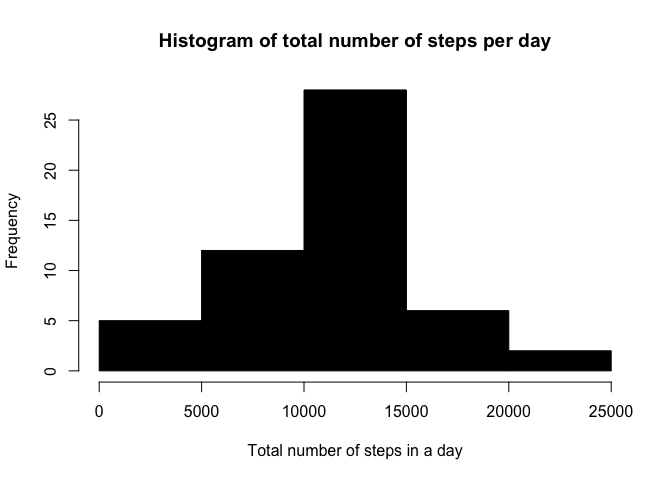
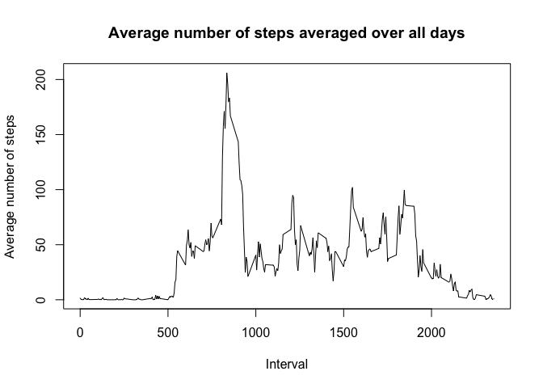
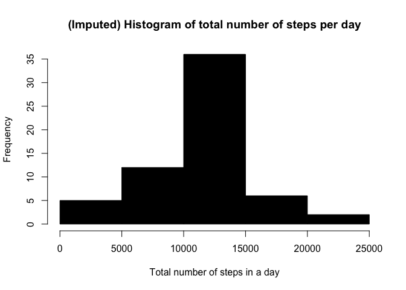
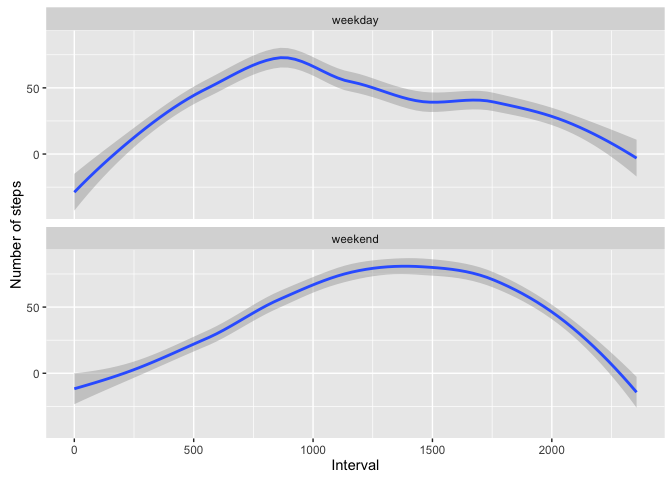

# Reproducible Research: Peer Assessment 1

#Reproducible Research Peer Assessment 1

##Loading and preprocessing the data

```r
# set the file url 
url <- "https://d396qusza40orc.cloudfront.net/repdata%2Fdata%2Factivity.zip"

# create a new directory and the placeholder file
td = tempdir()
tf = tempfile(tmpdir=td, fileext=".zip")

# download into file
download.file(url, tf, method="curl")

# unzip the file to the temporary directory
fname = unzip(tf, list=TRUE)$Name[1]
unzip(tf, files=fname, exdir=td, overwrite=TRUE)

# fpath is the full path to the extracted file
fpath = file.path(td, fname)

# load the csv in data frame
x <- read.csv(fpath, as.is=TRUE)
```

##What is mean total number of steps taken per day?


```r
#get rid of NA
compeltecases<-na.omit(x)

#total number of steps in a day
total_steps<-tapply(compeltecases$steps,compeltecases$date,sum)

# create histogram of total number of steps in a day
hist(total_steps, col=1, main="Histogram of total number of steps per day", 
     xlab="Total number of steps in a day")
```




```r
#Calculate mean and median total number of steps 
mean_steps<-mean(total_steps)
median_steps<-median(total_steps)
```

The mean and median total number of steps taken per day are `mean_steps` and `median_steps`. 

##What is the average daily activity pattern?

```r
#get the average number of steps in an interval 
interval_steps<-aggregate(steps ~ interval,compeltecases , mean)
#generate line plot
plot(interval_steps$interval,interval_steps$steps,type='l',col=1,main="Average number of steps averaged over all days", xlab="Interval", ylab="Average number of steps")
```



```r
#determine the row id of the max av number of steps in an interval
d<-which.max(interval_steps$steps)
#get the interval with the max av number of steps 
int<-interval_steps[d,]
```

The interval `int$interval` on average contains maximum number of steps (`int$steps`)

##Imputing missing values


```r
number_NA<-sum(!complete.cases(x))
```
The total number of missing values in the dataset is `number_NA`.


```r
# do the imputation. Replace by the mean of 5 min interval 
for (i in 1:nrow(x)){
  if (is.na(x$steps[i])){
    interval_val <-x$interval[i]
    row_id <- which(interval_steps$interval == interval_val)
    steps_val <- interval_steps$steps[row_id]
    x$steps[i] <- steps_val
  }
}

# aggregate steps as per date to get total number of steps in a day
imputed_steps_day<- aggregate(steps ~ date,x, sum)

# create histogram of total number of steps in a day
hist(imputed_steps_day$steps, col=1, main="(Imputed) Histogram of total number of steps per day", xlab="Total number of steps in a day")
```



```r
#with NAs replaced 
imputed_mean_steps<-mean(imputed_steps_day$steps)
imputed_median_steps<-median(imputed_steps_day$steps)
imputed_mean_steps
```

```
## [1] 10766.19
```

```r
imputed_median_steps
```

```
## [1] 10766.19
```

```r
#with NAs removed 
mean_steps<-mean(total_steps)
median_steps<-median(total_steps)
mean_steps
```

```
## [1] 10766.19
```

```r
median_steps
```

```
## [1] 10765
```
Due to the imputing there is no change in the means but there is a change in the median values of the steps. Thus, after imputing the median value increased slightly to `imputed_median_steps`. 

##Are there differences in activity patterns between weekdays and weekends?

```r
#convert date from string to Date
x$date<-as.Date(x$date,"%Y-%m-%d")
class(x$date)
```

```
## [1] "Date"
```

```r
#create a column with the date
x$day<-weekdays(x$date)

# create a new column called day type and initialize to weekday
x$day_type <- c("weekday")

# create a loop if day is Saturday or Sunday, make day_type as weekend
for (i in 1:nrow(x)){
  if (x$day[i] == "Saturday" || x$day[i] == "Sunday"){
    x$day_type[i] <- "weekend"
  }
}

x$day_type<-as.factor(x$day_type)

# aggregate steps as interval to get average number of steps in an interval across all days
table_interval_steps_imputed <- aggregate(steps ~ interval+day_type, x, mean)

# download ggplot and make a plot for weekends and weekdays 
library(ggplot2)
```

```
## Warning: package 'ggplot2' was built under R version 3.2.4
```

```r
ggplot(data=table_interval_steps_imputed, aes(interval, steps)) + geom_smooth() + xlab("Interval")+ 
      ylab("Number of steps") + facet_wrap(~ day_type, ncol=1)
```


